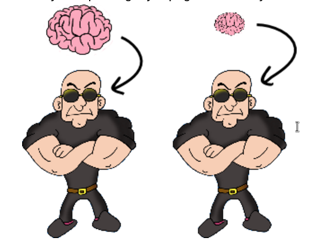

Amb bambes no s'entra 
==================================

L'amo d'una discoteca ha comprovat que els porters de discoteca com menys cervell tinguin més  bé van i a menys els pot enganyar pagant-los menys.

El problema és que al ser tant curts no són capaços d'entendre les ordres que els hi dona el cap. Quan els diu “deixeu entrar a totes les noies”  no se sap exactament què faran … 

Activitat: El cervell dels porters!
------------------------------------

Se us demana que desenvolupeu un programa que permeti als porters de discoteca decidir si una persona pot entrar o no segons els criteris que se’ls hi hagin donat.

Els criteris poden ser:

* Nom
* Edat
* Sexe: home/dona
* Què porta als peus: sabates, bambes o sandàlies
* Diners que porta

De manera que es pot decidir que poden entrar totes les noies, o els que es diuen Joan, o els que porten sandàlies i tenen 10 €

El programa rebrà una llista de gent i dirà quanta d'aquesta gent pot entrar.

Per exemple:

    Llista:
      Pere, 20, home, sabates, 25€
      Manel, 21 anys, home, bambes, 50€
      Maria, 18 anys, dona, sandàlies, 8€
      Mercè, 25 anys, dona, sabates, 100€
      Joan, 17 anys, home, bambes, 5 €

    Condició?  dones + 10€
    Resultat: Mercè

    Condició? 18 anys + 10 €
    Resultat: Pere, Manel, Mercè
